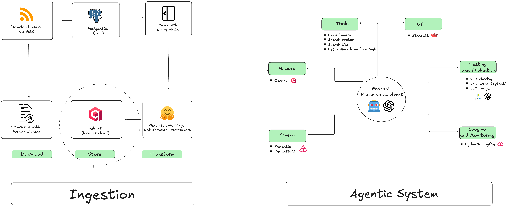

## Introduction
The Huberman Lab podcast consistently ranks in the top 5 across Apple and Spotify in the Health, Fitness, and Science categories, with over 7 million YouTube subscribers. While unequivocally popular, the episodes are long and often not easy to digest. Each episode averages 120 minutes and the longest episode, featuring Dr. Andy Galpin on "Optimal Protocols to Build Strength and Muscle," runs 279 minutes — that’s over 4.5 hours!

The podcast offers both knowledge and valuable tools that could improve our lives, but this content is hidden in excessively long episodes. An agentic system addresses this gap by acting as a personalized coach that extracts content from the podcast's knowledge base to recommend actionable tools that users can immediately implement. By grounding recommendations in evidence-based research and expert interviews from the podcast, the system ensures that recommendations are both scientifically sound and immediately actionable.

This project introduces the Podcast Research AI Agent. Audio files were downloaded via RSS and transcribed with Faster Whisper. Transcriptions are subsequently chunked using a sliding window approach and embedded using Hugging Face's Sentence Transformer model `all-MPNet-base-v2`. The final product utilizes the Qdrant vector database to store the knowledge base; however Elasticsearch was explored and code is provided for local implementation. 

The Pydantic framework and PydanticAI SK were used to develop the AI Agent. With OpenAI's `gpt-4o-mini` as the underlying brain, the Research Agent was given the following tools: search the knowledge base, fetch the latest research articles, and dissect the articles to give a synthesized report of the most up to date research regarding a respective topic. 

Testing and evaluation combine unit testing with pytest, vibe checking, and a LLM judge.

The diagram below delineates the developmental process and products/services used to develop this Research Agent.




## Setup
1. `uv` was used to manage Python packages and environment. To replicate this project, choose either uv or pip. This project uses `uv`, so for better chances of reproducibility, use `uv`.

    *Option 1*: Manage with uv
      - Install `uv` if you don't have already it. See [Astral documentation](!https://docs.astral.sh/uv/getting-started/installation/) for instructions.
      - Run `uv sync` on the command line to download all required packages to run this project.
      
    *Option 2*: Manage with pip
      - Run `pip install requirements.txt`. 
2. Docker Desktop was used to run the Docker Engine daemon.
    - Download Docker Desktop if you don't already have it. See [dockerdocs](!https://docs.docker.com/desktop/) for instructions.
    - Start Docker Desktop to run the Docker Engine daemon. 
    - Run `docker-compose up` to start all services or `docker-compose up -d` to run all services in detached mode so containers start in the background -- this way you can return to the command line and continue working.
3. This project cannot run without API keys. 
    
    *Required keys*

    - OPENAI models were used. Sign up for an [API key from OPEN AI](!https://auth.openai.com/create-account) if you don't already have one. 
    - The Brave API was used to develop the web search tool. Register for a [Brave API KEY](!https://api-dashboard.search.brave.com/register) here. 

    *Optional keys*
      
      - It is enough to run the vector databases locally. To upload embeddings to the cloud, obtain an API key from [Elasticsearch](!https://cloud.elastic.co/registration?pg=global&plcmt=nav&cta=205352-primary) or [Qdrant](!https://login.cloud.qdrant.io/u/signup/identifier?state=hKFo2SBfRTd1VlpiZHlTRFJ5a1NoUGp4T20yenJDSzhsUHI4baFur3VuaXZlcnNhbC1sb2dpbqN0aWTZIGsxZ1RDOUc0U2UxMlNjNkdWbktLcXBneEM0em9WMlNJo2NpZNkgckkxd2NPUEhPTWRlSHVUeDR4MWtGMEtGZFE3d25lemc). 


4. API keys are managed via `direnv`. API keys are stored in `.env` file with `.envrc` containing dotenv so API keys are loaded automatically. Example of a `.env` file: 

    ```.env 
    OPENAI_API_KEY=openai_api_key_value
    BRAVE_API_KEY=brave_api_key_value
    ```


## Ingestion

0. Downloading and transcribing transcripts is a process on its own. Here, I provide the transcripts as a parquet file. Please see [Ingestion](ingestion/README.md) if you'd like to replicate the process of downloading and transcribing.

1. Make sure Docker Desktop is running.

2. I offered two vector database options: Elasticsearch and Qdrant. The `docker-compose` file is set up to use both services. You can run both if you choose. I suggest choosing database that suits you best and remove the one you don't need. Then, start either start all services in detached mode with `docker-compose up -d` or just the vector database option you chose.

3. If you chose Elasticsearch, start the Elasticsearch and Kibana services.
    ```
    docker-compose up elasticsearch kibana -d
    ```
  
    *Optional*: Access the Kibana dashboard via your browser with http://localhost:5601. Note that this is not mandatory for ingestion. It is nice to interact with the embeddings via a UI but the agent can access the embeddings without the dasboard.

4. Ingestion with Elasticsearch

    *Skip steps 7-8 if you implemented with Elasticsearch.*


  
7. If you chose Qdrant, start the service:

    ```
    docker-compose up qdrant -d
    ```
  
   *Optional*: To access the Qdrant dashboard: Paste http://localhost:6333/dashboard in your browser.

8. To chunk and upload the embeddings to local Qdrant vector database takes about 2 hours. Run on  CLI:

    ```
    python ingestion/qdrant.py \
      --parquet-path transcripts/transcripts.parquet \
      --collection-name transcripts \
      --distance cosine \
      --target local 
    ```

    <u>*Recommendation*</u>: Add the `--limit` argument to the command to process a sample. For example, `--limit 100` chunks and uploads 100 transcripts. This will take around 40 minutes. 

      ```
      python ingestion/qdrant.py \
        --parquet-path transcripts/transcripts.parquet \
        --collection-name transcripts \
        --distance cosine \
        --target local \
        --limit 100
      ```

    *Optional*: You will be able to see your data on the Qdrant dashboard by pasting in your browser: http://localhost:6333/dashboard. 

    
## Agent


## Test and Evaluation

## Logging and Monitoring
